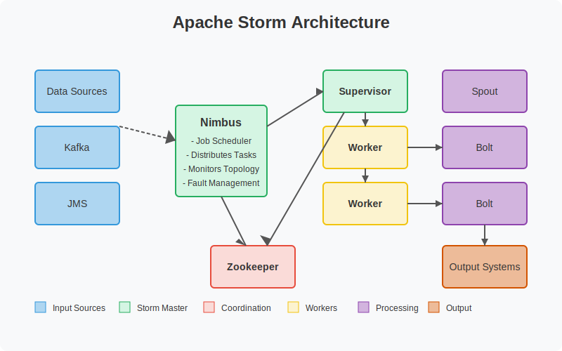

# big_data_analytics

Apache Pig simplifies big data processing by providing a high-level scripting language called Pig Latin that abstracts away the complexities of MapReduce programming. Instead of writing verbose Java code, developers can express data transformations using simple, SQL-like commands that are automatically optimized and converted into efficient MapReduce jobs. This abstraction typically reduces code by 90% compared to raw MapReduce implementations.

What makes Pig particularly powerful is its combination of built-in functions, support for complex data types, and schema flexibility. The platform handles ETL operations through an intuitive data flow paradigm, where data passes through a series of transformations (filtering, grouping, joining) with minimal code. Pig's optimization engine automatically improves execution plans, combining operations to minimize MapReduce cycles while providing the scalability and fault tolerance benefits of Hadoop's underlying

## Partitions in Hive
Partitioning in Hive is a technique that divides large tables into smaller, more manageable pieces based on the values of specific columns. Each partition acts as a subdirectory in the table's HDFS location, organizing data files according to partition key values (e.g., date, region, category). When queries include partition columns in their WHERE clauses, Hive only scans relevant partitions rather than the entire table.

Partitioning is crucial for performance optimization in big data environments for several reasons. First, it dramatically improves query speed through partition pruning, where irrelevant data partitions are skipped entirely. For example, when analyzing monthly sales data, a query for January transactions would only scan January's partition instead of the entire sales history. Second, it enables more efficient resource utilization as processing is distributed across smaller data chunks. Third, partitioning facilitates data lifecycle management, making it easier to archive or drop older partitions without affecting the entire table. Finally, it improves write performance by allowing parallel loading operations that target specific partitions without locking the entire table.

The strategic design of partition schemes directly impacts query performance, with effective partitioning often reducing execution times from hours to minutes for large-scale data warehousing operations.

## Key Differences Between Pig and Hive

### Language Paradigm and Approach
Hive uses HQL (HiveQL), a declarative SQL-like language where users specify what they want rather than how to get it. This makes Hive more accessible to SQL-proficient analysts and business users. Pig uses Pig Latin, a procedural dataflow language where users define a sequence of operations, making it more appealing to programmers who need fine-grained control over data transformation sequences.

### Data Processing Focus
Hive excels at structured data analytics, creating a data warehouse environment optimized for complex queries against tabular data with defined schemas. Pig shines in ETL (Extract, Transform, Load) pipelines and data preparation, with superior handling of complex transformations and data flows.

### Data Type Handling
Hive primarily targets structured data with predefined schemas, requiring schema definitions before querying. It operates best when data already fits tabular formats. Pig offers more flexibility with nested data structures and dynamic schemas, making it better suited for semi-structured and unstructured data processing.

### Impact on Different Data Types:

#### Structured Data
- **Hive**: Superior performance through optimized query plans, indexing, and partition pruning. Native SQL-like syntax makes it ideal for business intelligence and reporting.
- **Pig**: Less efficient for simple queries but offers programmatic flexibility for complex transformations.

#### Semi-structured Data (JSON, XML)
- **Hive**: Requires SerDes (Serializer/Deserializer) for processing. More rigid and potentially complex to set up.
- **Pig**: Native support for nested structures and flexible schemas. Can process semi-structured data with less pre-configuration.

#### Unstructured Data (text, logs)
- **Hive**: Limited capabilities, requiring data to be pre-processed into tabular format.
- **Pig**: Better suited for parsing and extracting structure from unstructured data through its data flow model and custom UDFs.

Organizations typically use both tools complementarily—Pig for initial data preparation and complex transformations, followed by Hive for structured analysis, reporting, and ad-hoc queries against the prepared data.

## MapReduce vs Apache Spark: Comparison and Contrast

### Key Differences

#### 1. Processing Model
MapReduce uses a two-stage disk-based processing paradigm, writing intermediate results to disk between jobs. Spark employs in-memory processing with its Resilient Distributed Dataset (RDD) abstraction, keeping data in memory across operations.

#### 2. Performance
MapReduce is typically 10-100x slower due to disk I/O bottlenecks. Spark achieves significantly better performance by minimizing disk operations and optimizing execution plans.

#### 3. Programming Model
MapReduce provides a rigid map-then-reduce paradigm with limited built-in operations. Spark offers a rich, flexible API with 80+ high-level operators and multiple language support (Scala, Java, Python, R).

#### 4. Use Cases
MapReduce excels at batch processing of very large datasets when memory is limited. Spark handles batch processing, iterative algorithms, interactive queries, and streaming data in a unified engine.

### Key Similarities
- Both distribute processing across clusters
- Both provide fault-tolerance mechanisms
- Both run on similar infrastructure (YARN, HDFS)
- Both follow functional programming paradigms

### Analysis of Example

- **Code Complexity**: Spark requires ~4 lines of functional code versus dozens of lines in MapReduce with complex class structures.
- **Development Speed**: Spark's higher-level abstractions allow faster development and iterative debugging.
- **Execution Efficiency**: The MapReduce job writes mapper outputs to disk before reduction, while Spark keeps intermediate results in memory.
- **Performance**: For this simple example, Spark typically completes 10-20x faster due to in-memory processing, especially when running multiple iterations.
- **Flexibility**: Spark's solution can be easily extended to include additional transformations (filtering, sorting, etc.) without additional overhead, while MapReduce would require separate jobs for each step.

In production environments, this performance gap becomes even more pronounced for complex analytics workflows with multiple transformations or iterative algorithms, explaining Spark's widespread adoption for modern big data processing.

## Apache Storm Architecture

Apache Storm is a distributed real-time computation system for processing streams of data. Unlike batch processing systems, Storm is designed to process unbounded streams of data in real-time with very low latency.

Key components of Apache Storm architecture:

- **Nimbus**: The master node that distributes code across the cluster, assigns tasks to machines, and monitors for failures
- **Supervisor**: Runs on worker nodes and starts/stops worker processes as directed by Nimbus
- **Worker**: A JVM process that executes a subset of a specific topology
- **Spout**: Source of data streams in a topology, reading from external sources and emitting tuples
- **Bolt**: Processes input streams and produces output streams, implementing the actual data processing logic
- **Zookeeper**: Coordinates the Storm cluster and maintains configuration information

The diagram below illustrates the Apache Storm architecture and the relationships between its components:

Storm's distributed architecture enables high throughput, fault-tolerance, and horizontal scalability for real-time analytics, making it an excellent choice for applications like real-time analytics, continuous computation, distributed RPC, and ETL.